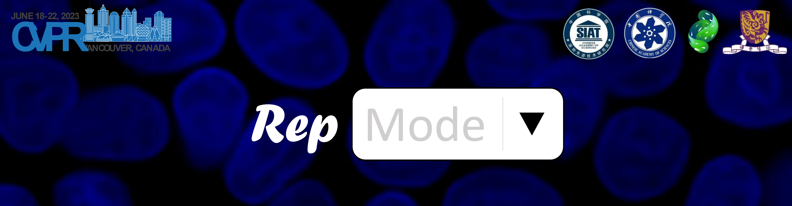

# [CVPR 2023 (Highlight)] RepMode: Learning to Re-parameterize Diverse Experts for Subcellular Structure Prediction


<!-- > **Authors**: [Donghao Zhou](https://correr-zhou.github.io/), Chunbin Gu, Junde Xu, Furui Liu, Qiong Wang, [Guangyong Chen](https://guangyongchen.github.io/), [Pheng-Ann Heng](http://www.cse.cuhk.edu.hk/~pheng/1.html)
>
> **Affiliations**: SIAT-CAS, UCAS, CUHK, Zhejiang Lab -->


<div align=center>

[](https://correr-zhou.github.io/RepMode/)
[](https://arxiv.org/pdf/2212.10066.pdf)
[](https://correr-zhou.github.io/RepMode/)

</div>


We introduce **subcellular structure prediction (SSP)**, which aims to predict the 3D fluorescent images of multiple subcellular structures from a 3D transmitted-light image, to the computer vision community. To overcome two crucial challenges of SSP, *i.e.* partial labeling and multi-scale, we propose **Re-parameterizing Mixture-of-Diverse-Experts (RepMode)**, a network that dynamically organizes its parameters with task-aware priors to handle specified single-label prediction tasks of SSP. RepMode acheives SOTA overall performance in SSP and show its potiental in task-increment learning.


<div align="center">

</div>


## 🔥 Updates
- 2023.04: The source code is now available!
- 2023.03: The [RepMode website](https://correr-zhou.github.io/RepMode/) is now online!
- 2023.03: This paper is selected as a **CVPR Highlight (Top 2.5% of 9155 submissions)**!
- 2023.02: We are delight to announce that this paper is accepted by CVPR 2023!


## 💻 Device Requirements
To run this code, please make sure that you have:
1. A computer with >50GB RAM (for loading the dataset)
2. An NVIDIA GPU with >20GB memory (we used an NVIDIA V100 GPU with 32GB memory)
3. A Linux operating system (we used Ubuntu 18.04.5)


## 🛠️ Installation
1. Create a Conda environment for the code:
```
conda create --name SSP python=3.9.12
```
2. Activate the environment:
```
conda activate SSP
```
3. Install the dependencies:
```
pip install -r requirements.txt
```
4. Following [this guide](https://docs.wandb.ai/quickstart#set-up-wb) to set up [W&B](https://wandb.ai/) (a tool for experimental logging).


## 💽 Preparing Datasets

We adopt a dataset collection (released by [Allen Institute for Cell Science](https://www.allencell.org/)) containing twelve partially labeled datasets, each of which corresponds to one category of subcellular structures (*i.e.* one single label prediction task).

### Downloading Data
Change the current directory of the terminal to the path to this code:
```
cd {PATH-TO-THIS-CODE}
```
Download the dataset collection:
```
bash scripts/dataset/download_all_data.sh
```

### Spliting Data
First, conduct train/val/test dataset spliting for eleven datasets:
```
bash scripts/dataset/split_train_set.sh
bash scripts/dataset/split_val_set.sh
```
Then, construct the DNA dataset based on the existing eleven datasets:
```
bash scripts/dataset/make_dna_dataset.sh
```
> ❗❗❗ Notably, each transmitted-light image in this collection have an extra DNA annotation but there are not a specialized DNA dataset.
> Therefore, the samples of the DNA dataset are collected from the other datasets.

### Integrating data
The last step is to format these twelve datasets and integate them:
```
bash scripts/dataset/integ_dataset.sh
```
The above command would run `main.py` to process the data and finally generate three `.pth` files for train/val/test, respectively.
Besides, it can also check if the code is ready to run.
At the beginning of training, the resultant `.pth` files will be directly loaded into RAM to accelerate the dataset loading during training.


## 🔬 Training and Evaluation

Run the following command to train and evaluate a model:
```
bash scripts/run/train_and_eval.sh {GPU_IDX} {MODEL_NAME} {EXP_NAME}
```
Command-line arguments are as follows:
1. `{GPU_IDX}`: The index of GPU which you want to adopt. (*default*: `0`)
2. `{MODEL_NAME}`: The model used for training and evaluation. (*default*: `RepMode`)
3. `{EXP_NAME}`: The directory to save the experimental data (logs, checkpoint, *etc.*). (*default*: `exps/test` | we recommend setting it to a sub-directory of `exps/`)

For example, to train and evaluate `RepMode` with the GPU `1` and save the experimental data in `exps/benchmark_RepMode`, please run:
```
bash scripts/run/train_and_eval.sh 1 RepMode exps/benchmark_RepMode
```

If you only want to evaluate a trained model, please run:
```
bash scripts/run/only_eval.sh {GPU_IDX} {MODEL_NAME} {EXP_NAME} {MODEL_PATH}
```
Command-line arguments are as follows:
1. `{GPU_IDX}`, `{MODEL_NAME}`, `{EXP_NAME}`: The same as above.
2. `{MODEL_PATH}`: The path to the trained model used for evaluation. (*default*: `exps/test/checkpoints/model_best_test.p`)

If you would like to customize this code, check out `scripts\`, `main.py`, `eval.py`, and `config.py` for more details!

## 📑 Citation
If you find that our work is helpful in your research, please consider citing our paper:
```latex
@misc{zhou2022repmode,
      title={RepMode: Learning to Re-parameterize Diverse Experts for Subcellular Structure Prediction},
      author={Zhou, Donghao and Gu, Chunbin and Xu, Junde and Liu, Furui and Wang, Qiong and Chen, Guangyong and Heng, Pheng-Ann},
      journal={arXiv preprint arXiv:2212.10066},
      year={2022}
}
```

## ✉️ Contact
Feel free to contact me (Donghao Zhou: [dh.zhou@siat.ac.cn](mailto:dh.zhou@siat.ac.cn)) if anything is unclear or you are interested in potential collaboration.

## 🤝 Acknowledgement
Our code is built upon the repository of [pytorch_fnet](https://github.com/AllenCellModeling/pytorch_fnet/). We would like to thank its authors for their excellent work. If you want to use and redistribe our code, please follow [this license](https://github.com/Correr-Zhou/RepMode/blob/LICENSE) as well.
